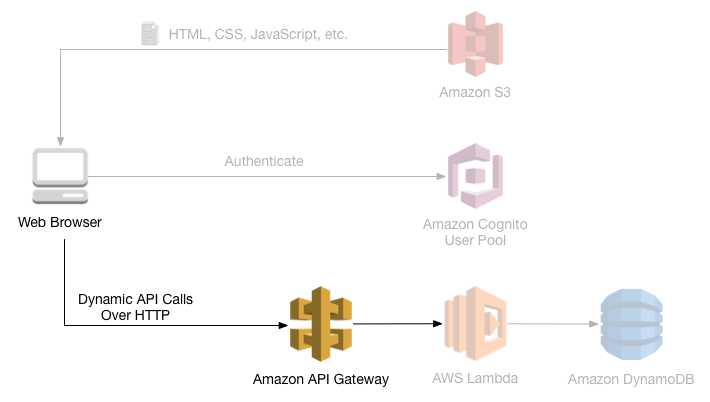
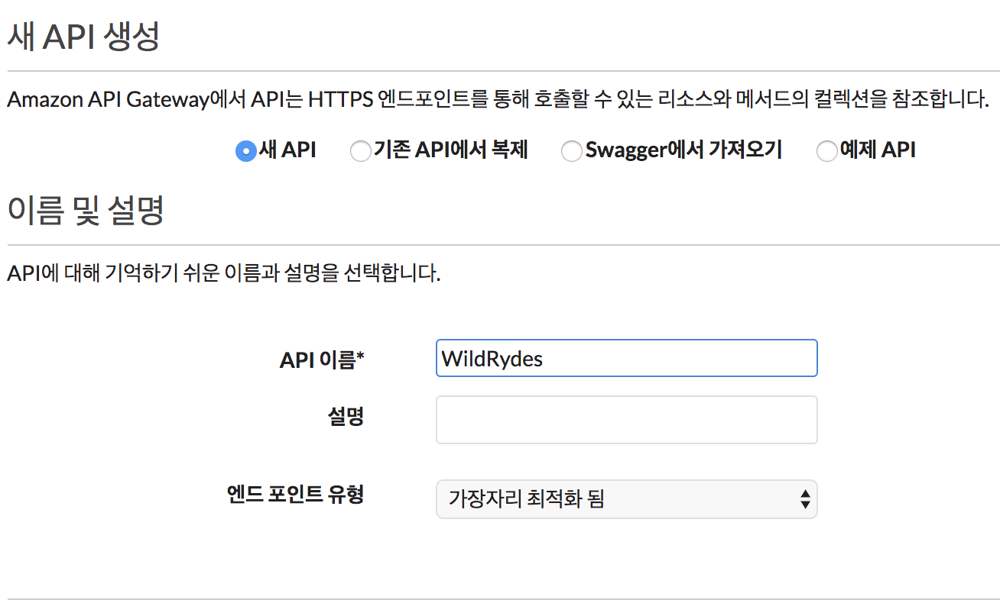
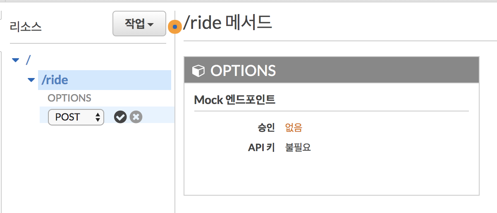

# 모듈 4: AWS Lambda 및 Amazon API Gateway를 사용해서 RESTful API를 만들어봅시다

이 모듈에서는 API Gateway 를 사용하여 이전 모듈에서 작성한 람다 함수를 RESTful API로 보여줍니다. 이 API 는 공용 인터넷에서 접근할 수 있습니다. 이 모듈은 이전 모듈에서 생성한 Amazon Cognito 사용자 풀을 사용하여 보호됩니다. 이 구성을 사용하면 노출된 API에 AJAX 호출을 수행하는 클라이언트쪽의 JavaScript 를 추가하여 정적으로 호스팅 된 웹 사이트를 동적 웹 응용 프로그램으로 바꿀 수 있습니다.



위의 다이어그램은 이 모듈에서 빌드할 API Gateway 구성요소가 이전에 빌드한 기존 구성 요소와 어떻게 통합되는지 보여줍니다. 회색으로 표시된 항목은 이전 단계에서 이미 구현한 부분입니다.

첫번째 모듈에서 배포한 정적 웹 사이트에는 이미 이 모듈에서 빌드할 API와 상호작용하도록 구성된 페이지가 있습니다. /ride.html 페이지에는 유니콘 탑승을 요청하기위한 간단한 지도 기반 인터페이스가 있습니다. /signin.html 페이지를 사용해서 로그인 한 뒤 사용자는 지도상의 특정 지점을 클릭한 다음 오른쪽 상단 모서리에 있는 "Request Unicorn" 버튼을 선택하여 탑승 위치를 선택할 수 있습니다.

이 모듈에서는 API의 클라우드 구성 요소를 작성하는데 필요한 단계에 초점을 맞춥니다. 이 API를 호출하는 브라우저 코드의 작동 방식에 관심이 있는 경우 [ride.js](../1_StaticWebHosting/website/js/ride.js) 파일을 확인하시면 됩니다. 이 앱에서는 jQuery의 [ajax()](https://api.jquery.com/jQuery.ajax/) 메소드를 사용하여 원격 요청을 합니다.

## 구현 지침

다음 섹션에서는 구현 개요와 자세한 단계별 지침을 제공합니다. 개요는 이미 AWS Management Console에 익숙하거나 둘러보기를 거치지 않고 직접 서비스를 탐색하려는 경우 구현을 완료하는 데 충분한 내용을 제공합니다.

최신 버전의 Chrome, Firefox, 혹은 Safari 웹 브라우저를 사용하는 경우 섹션을 펼쳐야 단계별 지침이 표시됩니다.

### 1. 새로운 REST API 만들기
Amazon API Gateway 콘솔을 사용해서 새로운 API를 작성하십시오.

<details>
<summary><strong>단계별 지침 (자세한 내용을 보려면 펼쳐주세요)</strong></summary><p>

1. AWS Management 콘솔에서, **서비스** 를 클릭한 다음 Application Services 섹션에서 **API Gateway** 를 선택하십시오.

1. **API 작성** 을 선택하십시오.

1. **새 API** 을 선택하고 **API 이름** 에 `WildRydes` 를 입력하십시오.

1. **API 생성** 을 선택하십시오

    

</p></details>


### 2. Cognito 사용자 풀 인증 프로그램(user pool Authorizer) 만들기
Amazon API Gateway 콘솔에서 API에 대한 새로운 Cognito 사용자 풀 인증 프로그램(user pool Authorizer)를 작성하십시오. 이전 모듈에서 작성한 사용자 풀의 세부 사항으로 구성하십시오. 현재 웹 사이트의 /signin.html 페이지를 통해 로그인 한 뒤 표시되는 인증 토큰을 복사하여 붙여넣어 콘솔에서 구성을 테스트 할 수 있습니다.

<details>
<summary><strong>단계별 지침 (자세한 내용을 보려면 펼쳐주세요)</strong></summary><p>

1. 새로 작성된 API에서, **권한 부여자** 를 선택하십시오 .

1. **새로운 권한 부여자 생성** 버튼을 선택하십시오.

2. 이름에 `WildRydes`를 입력하십시오

3. 유형은 `Cognito`를 선택하십시오

4.  **Cognito 사용자 풀**은 드랍 다운 목록에서 `WildRydes`를 선택하십시오

5. **토큰 원본**에 `Authorization`를 입력하십시오

6. **Create**를 선택하십시오

#### 인증자 프로그램(authorizer) 구성을 확인하기

1. 새로운 웹 브라우저 탭을 열고 웹 사이트 도메인 아래에서 `/ride.html` 을 방문하십시오.

1. 로그인 페이지로 리다이렉션 된 경우, 마지막 모듈에서 생성한 사용자로 로그인 하십시오. `/ride.html` 페이지로 이동할 것입니다.

1. `/ride.html` 알림의 인증 토큰을 복사한뒤, API Gateway 콘솔 탭의 **권한 부여자** 탭에서  **테스트** 버튼을 선택하고, 팝업창이 뜨면 **Identity token** 입력칸에 붙여넣습니다.

1.  **테스트** 를 선택하고 귀하의 사용자에 대한 클레임이 표시된것을 확인하십시오.

</p></details>

### 3. 새 리소스 및 메소드 만들기
API 내에 /ride 라는 새 리소스를 만듭니다. 그런 다음 해당 리소스에 대한 POST 미소드를 작성하고 이 모듈의 첫번째 단계에서 작성한 RequestUnicorn 함수로 람다 프록시 통합(Lambda proxy integration)을 사용하도록 구성하십시오.

<details>
<summary><strong>단계별 지침 (자세한 내용을 보려면 펼쳐주세요)</strong></summary><p>

1. 왼쪽 네비게이션 메뉴에서 WildRydes API 아래의 **Resources** 를 클릭하십시오.

1. **작업** 드롭 다운 메뉴에서 **리소스 생성** 를 선택하십시오.

1. **리소스 이름** 으로 `ride` 를 입력하십시오.

1. **리소스 경로** 가 `ride` 로 설정되어있는지 확인하십시오.

1. **API Gateway CORS 활성화** 체크박스를 체크하십시오.

1. **리소스 생성** 을 클릭하십시오.

1. 새로 생성된 `/ride` 리소스가 선택되면, **Action** 드롭 다운 메뉴에서 **메서드 생성** 를 선택하십시오.

1. 새로 나타나는 드롭 다운 메뉴에서 `POST` 를 선택한 다음 체크 표시를 클릭하십시오.

    

1. 통합 유형(integration type)으로 **Lambda 함수** 를 선택하십시오.

1. **Lambda 프록시 통합 사용** 체크박스를 선택하십시오.

1. **Lambda Region** 에 **ap-northeast2** 를 선택하십시오

1. 이전 모듈에서 작성한 함수의 이름인 `RequestRide` 를 **Lambda Function** 에 입력하십시오.

    
    
1. 오른쪽 하단의 **저장** 을 선택하십시오.

1. **Lambda 함수에 대한 권한 추가** 관련 팝업이 나오면 확인을 선택하십시오.

1. **메서드 요청** 카드를 선택하십시오.

1. **승인** 옆에 있는 연필 아이콘을 선택하십시오.

1. 드롭 다운 목록에서 WildRydes Cognito 사용자 풀 인증 프로그램(user pool authorizer) 을 선택하고 확인 표시 아이콘을 클릭합니다.

    

</p></details>

### 4. CORS 사용 설정하기
최신 웹 브라우저는 한 도메인에서 호스팅되는 페이지의 스크립트에서 명시적으로 허용하는 HTTP 접근 제어(CORS) 응답 헤더를 제공하지 않는 한 다른 도메인에서 호스팅되는 API에 대한 HTTP 요청을 차단합니다. Amazon API Gateway 콘솔에서 자원을 선택했을때 필요한 구성을 추가하여 조치메뉴 아래에 적절한 CORS 헤더를 보낼 수 있습니다. /requestunicorn 리소스에서 POST 및 OPTIONS 에 대해 CORS 를 사용해야합니다. 간단하게 하기 위해 Access-Control-Allow-Origin 헤더 값을 '\*' 로 설정할 수 있지만, 실제 운영환경에서는 [cross-site request forgery (CSRF - 크로스 사이트 요청 위조)](https://www.owasp.org/index.php/Cross-Site_Request_Forgery_%28CSRF%29) 공격에 대비하기 위해 항상 권한 있는 도메인을 명시적으로 허용해야 합니다.

일반적으로 CORS 구성에 관한 자세한 내용은 https://developer.mozilla.org/en-US/docs/Web/HTTP/Access_control_CORS 를 참고하십시오.

<details>
<summary><strong>단계별 지침 (자세한 내용을 보려면 펼쳐주세요)</strong></summary><p>

1. Amazon API Gateway 콘솔의 가운데 패널에서 `/ride` 리소스를 선택하십시오.

1. **작업** 드롭 다운 목록에서 **CORS 활성화** 를 선택하십시오.

1. 기본 설정을 사용하고 **CORS 활성화 및 기존의 CORS 헤더 대체** 를 선택하십시오.

1. **예, 기존 값을 대체하겠습니다.** 를 선택하십시오.

1. 모든 단계 옆에 체크 표시가 나타날때까지 기다립니다.

</p></details>

### 5. API 배포하기
Amazon API Gateway 콘솔에서 작업 를 선택하고, API 배포 를 선택하십시오. 새 스테이지를 만들라는 메시지가 표시됩니다. 스테이지 이름으로는 prod 를 사용할 수 있습니다.

<details>
<summary><strong>단계별 지침 (자세한 내용을 보려면 펼쳐주세요)</strong></summary><p>

1. **작업** 드롭 다운 목록에서 **API 배포** 를 선택하십시오.

1. **배포 스테이지** 드롭 다운 목록에서 **[새 스테이지]**를 선택하십시오

1. **스테이지 이름** 에 `prod` 를 입력하십시오.

1. **배포** 를 선택하십시오.

1. **URL 호출** 을 미리 메모장에 복사해놓으십시오. 다음 섹션에서 사용합니다.

</p></details>

### 6. 웹사이트 config 파일 업데이트
방금 만든 스테이지의 호출 URL(Invoke URL)을 포함하도록 웹 사이트 배포에서 /js/config.js 파일을 업데이트 합니다. Amazon API Gateway 콘솔의 스테이지 편집기 페이지 상단에서 직접 호출 URL을 복사해서 사이트의 /js/config.js 파일의 \_config.api.invokeUrl 키에 붙여 넣어야합니다. config 파일을 업데이트 할 때 Cognito 사용자 풀에 대한 이전 모듈에서 작성한 업데이트가 포함되어 있는지 확인하십시오.

<details>
<summary><strong>단계별 지침 (자세한 내용을 보려면 펼쳐주세요)</strong></summary><p>

1. 텍스트 편집기에서 config.js 파일을 엽니다.

1. config.js 파일의 **api** 키 아래에서 **invokeUrl** 설정을 업데이트 하십시오. 이전 섹션에서 작성한 배포 단계(deployment stage) 의 값을 **Invoke URL** 로 설정하십시오.

    완전한 `config.js` 파일의 예제가 아래에 포함되어 있습니다.

    ```JavaScript
    window._config = {
        cognito: {
            userPoolId: 'ap-northeast-2_IfOIfOh4n', // e.g. ap-northeast-2_uXboG5pAb
            userPoolClientId: '5a94rj11ldotcknbaat38lavt7', // e.g. 25ddkmj4v6hfsfvruhpfi7n4hv
            region: 'ap-northeast-2' // e.g. ap-northeast-2
        },
        api: {
            invokeUrl: 'https://2c5292i83i.execute-api.ap-northeast-2.amazonaws.com/prod' // e.g. https://rc7nyt4tql.execute-api.ap-northeast-2.amazonaws.com/prod',
        }
    };
    ```

1. 변경 사항을 로컬에 저장하십시오.

1. AWS Management 콘솔에서 **서비스** 를 선택한 다음, Storage 에서 **S3** 를 선택하십시오.

1. 귀하의 웹 사이트 버킷을 선택하고 `js` 폴더로 이동하십시오.

1. **업로드** 를 선택하십시오.

1. **파일 추가** 를 선택하고, `config.js` 의 로컬 복사본을 선택한 다음 **업로드** 을 클릭하십시오.

</p></details>

## 작성한 내용 검증하기

1. 귀하의 웹 사이트 도메인 아래에서 `/ride.html` 을 방문하십시오.

1. 로그인 페이지로 리다이렉션 된 경우, 이전 모듈에서 생성한 사용자로 로그인 하십시오.

1. 웹 페이지에서 지도가 로드된 이후 , 아무 장소나 클릭해서 픽업 위치를 선택합니다.

1. **Request Unicorn** 을 선택하십시오. 오른쪽 사이드바에 유니콘이 오고 있다는 알림이 표시되고, 유니콘 아이콘이 픽업 위치로 이동하는것을 볼 수 있습니다.

작성한 리소스를 삭제하는 방법은 이 워크샵의 [삭제 가이드](../9_CleanUp) 를 참고하십시오. **중요합니다**
